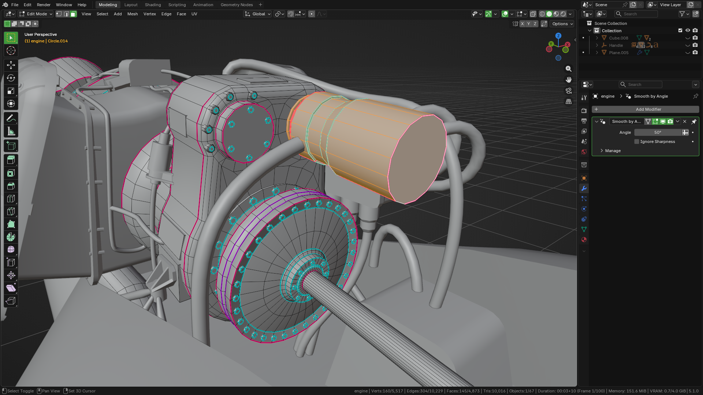

# Pjavel Theme
Green accented theme with some darker backgrounds here and there.



## Design decisions
Backgrounds were darkened since default dark theme feels more gray than dark.
Default blue color was changed to match my widely used green color #1FB311. Selection colors were adjusted away from default blue color.

### 3D Viewport
Harsh mesh edge colors while editing have been relaxed a bit.

### Node editor
Node background is now slightly transparent to make links behind them a bit more visible. Links received a bit of orange tint to reflect their selection status.

### Properties panel
Tab icons were given a bit more pop. Search color wasn't left unchanged. 

### Outliner panel
Selection color was adjusted to make it a bit more seamless. More visibility was added to currently edited data blocks.

## Building
If you want an extension you can use the following command.
```
blender --command extension build
```
