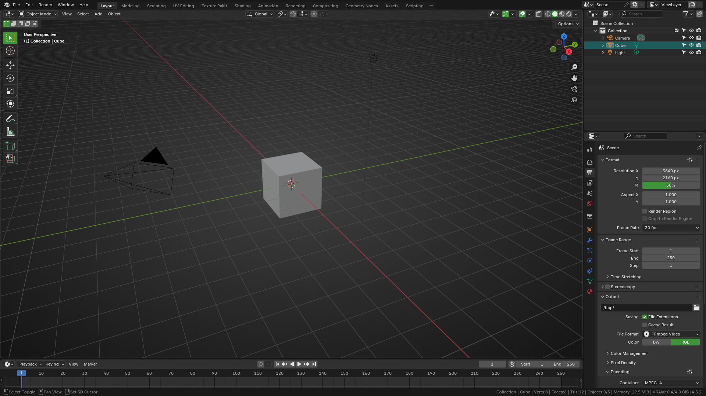

# Pjavel Theme
Green accented theme with some darker backgrounds here and there.

## Design decisions
Most of the grays are default. However backgrounds were darkened a bit since default dark theme feels more gray than dark.
Default blue color was changed in hue to match my widely used green color `#1FB311`.

### Properties panel
Tab icons were given a bit more pop.

### Outliner panel
Selection color was adjusted to make it a bit more seamless.

### Timeline panel (and others)
Current frame cursor was kept with default color for better visibility.
